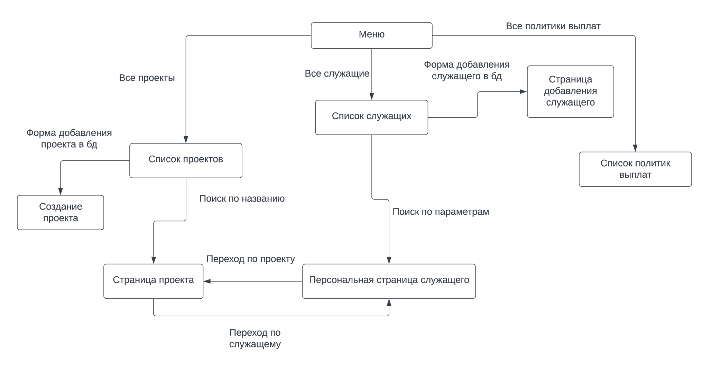

Зарплатная ведомость
=======================
Описание страниц
-----------------------

-----------------------
С любой страницы можно перейти на главную, нажав соответвующую кнопку.
### Главная страниц
- Ссылка на список всех служащих
- Ссылка на список всех проектов
- Ссылка на список всех политик выплат
- Ссылка на форму для добавления служащего
### Страница со списком всех сотрудников
- Список всех сотрудников, зарегистрированных в базу данных с их id, ФИО и данными об их участии в проектах, занимаемой должности, стаже и списке премий
- На каждого сотрудников можно нажать, что приведет на его персональную страницу
- Форма для поиска по ФИО и данными об их участии в проектах, занимаемой должности, стаже и по списку их премий
### Страница со списком всех политик выплат
- Список всех политик выплат с возможностью их редактирования и удаления
- Форма и кнопка для добавления политики
### Страница добавления сотрудника
- Форма для ввода всех данных о новом сотруднике
- Кнопка для загрузки данных из формы в бд
### Страница со списком всех проектов
- Поиск проекта по названию
- На каждый проект можно нажать, что приведет на его страницу
- Ссылка на форму для добавления нового проекта
- Кнопка удаления проекта
### Страница создания проекта
- Форма для ввода всех данных о новом проекте и кнопка загрузки данных в бд
### Страница проекта
- Возможность редактирования всех данных проекта
- На странице присутствует список сотудников проекта. Для каждого указан id, ФИО и его роль
- Возможность добавления сотрудников с назначением им роли (форма над списком сотрудников проекта) или удаления сотрудника из проекта
- На каждого сотрудников можно нажать, что приведет на его персональную страницу
### Персональная страница сотрудника
- Редактирование всех данных сотрудника, кроме истории участия в проектах, карьерной истории и истории выплат для служащего
- Просмотр всех данных о сотруднике
- На каждый проект, в котором участвовал сотрудник, можно нажать, что приведет на его страницу
- Форма с кнопкой для назначения выплат сотруднику
- Кнопка удаления сотрудника
Схема базы данных
-----------------

Сценарии использования
----------------------
### Получение списка служащих, в т.ч. по должностям, проектам, стажу и премиям
- Перейти на главную страницу
- Перейти на страницу со списком всех сотрудников
- Вписать нужные данные в форму поиска данные и нажать на кнопку поиск
### Получение истории участия в проектах, карьерной истории для служащего и истории выплат
- Перейти на главную страницу
- Перейти на страницу со списком всех сотрудников
- Вписать ФИО нужного сотрудника и нажать на кнопку поиск
- Нажать на нужного сотрудника, чтобы попасть на его персональную страницу, на которой хранятся все данные о сотрудниках
### Назначение сотрудника на новую должность
- Перейти на главную страницу
- Перейти на страницу со списком всех сотрудников
- Вписать ФИО(или id) нужного сотрудника и нажать на кнопку поиск
- Нажать на нужного сотрудника, чтобы попасть на его персональную страницу
- Нажать на кнопку редактирования и ввести в поле должность новую должность
- Нажать кнопку сохранить
### Добавление сотрудника в проект
- Перейти на главную страницу
- Перейти на страницу со списком всех проектов
- Вписать название проекта в форму поиска и нажать кнопку поиска
- Нажать на проект, чтобы перейти на его страницу
- Ввести id, ФИО и роль для сотрудника
### Удаление сотрудника из проекта
- Перейти на главную страницу
- Перейти на страницу со списком всех проектов
- Вписать название проекта в форму поиска и нажать кнопку поиска
- Нажать на проект, чтобы перейти на его страницу
- Нажать напротив нужного сотрудника в списке кнопку удаления
### Добавление служащего
- Перейти на главную страницу
- Перейти на страницу добавления сотрудника
- Ввести в поля данные о сотруднике и нажать кнопку добавить
### Удаление служащего
- Перейти на главную страницу
- Перейти на страницу со списком всех сотрудников
- Вписать ФИО(или id) нужного сотрудника и нажать на кнопку поиск
- Нажать на нужного сотрудника, чтобы попасть на его персональную страницу
- Нажать на кнопку удалить
### Чтения данных о служащем
- Перейти на главную страницу
- Перейти на страницу со списком всех сотрудников
- Вписать ФИО(или id) нужного сотрудника и нажать на кнопку поиск
- Нажать на нужного сотрудника, чтобы попасть на его персональную страницу
### Редактирование данных о служащем
- Перейти на главную страницу
- Перейти на страницу со списком всех сотрудников
- Вписать ФИО(или id) нужного сотрудника и нажать на кнопку поиск
- Нажать на нужного сотрудника, чтобы попасть на его персональную страницу
- Нажать на кнопку редактирования и ввести нужные данные
- Нажать кнопку сохранить
### Добавление проекта
- Перейти на главную страницу
- Перейти на страницу со списком всех проектов
- Перейти на страницу добавления проекта
- Ввести в поля данные о проекте и нажать кнопку добавить
### Удаление проекта
- Перейти на главную страницу
- Перейти на страницу со списком всех проектов
- Вписать название проекта в форму поиска и нажать кнопку поиска
- Нажать на проект, чтобы перейти на его страницу
- Нажать на кнопку удалить
### Чтение данных о проекте
- Перейти на главную страницу
- Перейти на страницу со списком всех проектов
- Вписать название проекта в форму поиска и нажать кнопку поиска
- Нажать на проект, чтобы перейти на его страницу
### Редактирование данных о проекте
- Перейти на главную страницу
- Перейти на страницу со списком всех проектов
- Вписать название проекта в форму поиска и нажать кнопку поиска
- Нажать на проект, чтобы перейти на его страницу
- Нажать на кнопку редактирования и ввести нужные данные
- Нажать кнопку сохранить
### Добавление политик выплат
- Перейти на главную страницу
- Перейти на страницу со списком всех политик выплат
- Ввести в форму название и сумму выплат
- Нажать кнопку добавить
### Удаление политик выплат
- Перейти на главную страницу
- Перейти на страницу со списком всех политик выплат
- Нажать напротив нужной политики кнопку удалить
### Чтение данных о политиках выплат
- Перейти на главную страницу
- Перейти на страницу со списком всех политик выплат
### Редактирование данных о политиках выплат
- Перейти на главную страницу
- Перейти на страницу со списком всех политик выплат
- Нажать напротив нужной политики кнопку редактировать и внести изменения
- Нажать кнопку сохранить
### Назначение выплаты сотруднику
- Перейти на главную страницу
- Перейти на страницу со списком всех сотрудников
- Вписать ФИО(или id) нужного сотрудника и нажать на кнопку поиск
- Нажать на нужного сотрудника, чтобы попасть на его персональную страницу
- Ввести в форму название выплаты и нажать на кнопку назначить
